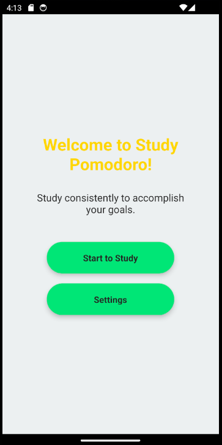
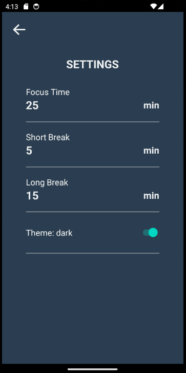

# `STUDY POMODORO`
## Descrição
- Projeto desenvolvido em React Native que implementa um timer de pomodoro. O aplicativo busca auxiliar estudantes que desejam seguir a técnica de estudo pomodoro, com uma seção de foco seguida de uma seção de pausa.
- O aplicatio possui modos de **Foco**, **Pausa** e **Pausa Longa**, permitindo que o usuário alterne entre elas automaticamente, ou escolha manualmente o modo que deseja seguir.
- Nas configurações do app é possível alterar o tema da aplicação e alterar o tempo padrão de cada um dos modos disponível.

## Imagens
| Tema Claro | Tema escuro | Tela do Timer | Tela de configurações |
| --- | --- | --- | --- |
|  |  |  | 

## Informações técnicas
### Como rodar a aplicação
- Depois de clonar o repositório e instalar as dependências, no terminal, digite o seguinte comando:
  ```bash
  npm start
  ```
- Com esse comando será iniciada a aplicação expo. É possível abrir o app instalando o aplicativo expo no celular e apontando para o qr que aparecer no terminal, ou usando um emulador de android.

### Versão das Bibliotecas utilizadas:
- @react-native-async-storage/async-storage = 1.21.0
- @react-native-picker/picker = 2.6.1
- @react-navigation/native = 6.1.9
- @react-navigation/native-stack = 6.9.17
- expo = 49.0.15
- react = 18.2.0
- react-native = 0.72.6
- react-native-animatable = 1.4.0
- react-native-safe-area-context = 4.6.3
- react-native-screens = 3.22.0
- react-native-vector-icons = 10.0.3
